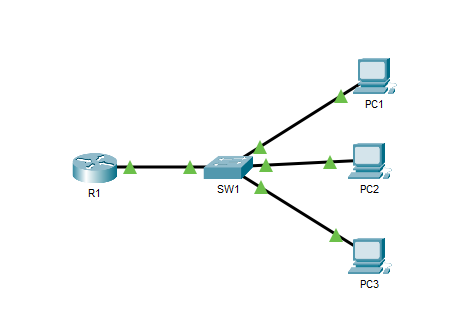
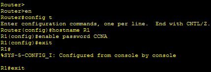
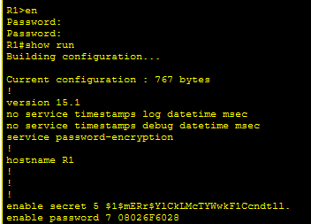

# CCNA Day 4 Lab – CLI Basics, Hostname Configuration, and Password Security


---

## Overview

This lab covers foundational Cisco IOS CLI skills — configuring hostnames, setting enable passwords, encrypting passwords with `service password-encryption`, and configuring a more secure `enable secret`. The lab demonstrates the difference between Type 7 (weak) and Type 5 (MD5) password encryption visible in the running configuration, and reinforces the rule that `enable secret` always takes precedence over `enable password` when both are configured.

---

## Environment

| Tool | Purpose |
|------|---------|
| Cisco Packet Tracer | Network simulation and IOS CLI practice |
| Cisco Router (R1) | Primary device for CLI and password configuration |
| Cisco Switch (SW1) | Secondary device for hostname and password configuration |
| PCs (x3) | PC1, PC2, PC3 — LAN endpoints |
| GitHub | Documentation and version control |

---

## Network Topology


*CCNA Day 4 Lab — R1 connected to SW1, SW1 connected to PC1, PC2, and PC3 — all green links confirmed active*

---

## Lab Tasks and Commands

---

### ✅ Task 1 — Changed Hostnames to R1 and SW1

Entered global configuration mode on both devices and set the hostname using the `hostname` command.

```
Router>en
Router#config t
Router(config)#hostname R1
R1(config)#
```

```
Switch>en
Switch#config t
Switch(config)#hostname SW1
SW1(config)#
```

---

### ✅ Task 2 — Configured Unencrypted Enable Password

Set an unencrypted enable password of **CCNA** on both devices using `enable password`.

```
R1(config)#enable password CCNA
R1(config)#exit
```

---

### ✅ Task 3 — Tested the Enable Password

Exited to user EXEC mode and entered `en` to return to privileged EXEC mode. Entered **CCNA** when prompted — access granted confirming the password was working.

```
R1#exit
R1>en
Password:
R1#
```

---

### ✅ Task 4 — Viewed Password in Running Configuration

Ran `show run` to view the running configuration. The enable password appeared in **plaintext** — visible as `enable password CCNA` confirming it was unencrypted at this stage.

---

### ✅ Task 5 — Encrypted All Passwords with Service Password-Encryption

Applied `service password-encryption` in global configuration mode to encrypt the current enable password and all future passwords configured on the device.

```
R1(config)#service password-encryption
```

---

### ✅ Task 6 — Viewed Encrypted Password in Running Configuration

Ran `show run` again after enabling service password-encryption. The enable password now appeared as a **Type 7** encrypted string — `enable password 7 08026F6028` — confirming the encryption was applied.


*Router CLI — hostname R1 set, enable password CCNA configured, service password-encryption applied,
Type 7 encrypted password visible in show run output*

---

### ✅ Task 7 — Configured Secure Enable Secret

Configured a more secure encrypted enable password of **Cisco** using `enable secret`. The enable secret uses MD5 hashing (Type 5) which is significantly stronger than the Type 7 encoding used by service password-encryption.

```
R1(config)#enable secret Cisco
```

---

### ✅ Task 8 — Tested Which Password Takes Precedence

Exited to user EXEC mode and entered `en`. When both `enable password` and `enable secret` are configured, **enable secret always takes precedence**. Entered **Cisco** — access granted. Entering **CCNA** was rejected.

```
R1>en
Password:
R1#
```

**Answer: The enable secret (Cisco) takes precedence over the enable password (CCNA) when both are configured.**

---

### ✅ Task 9 — Viewed Both Passwords in Running Configuration

Ran `show run` to compare the encryption types of both passwords.


*Show run output — enable secret Type 5 (MD5) and enable password Type 7 (weak encoding) both visible*

**Answers:**
- `enable password` encryption type: **Type 7** (weak — reversible Vigenere cipher encoding)
- `enable secret` encryption type: **Type 5** (strong — MD5 hash, not reversible)

---

### ✅ Task 10 — Saved Running Configuration to Startup Configuration

Saved the running configuration to startup configuration so all settings persist after a reboot.

```
R1#copy running-config startup-config
```
or

```
R1#write memory
```

---

## Key Concepts

| Concept | Explanation |
|---------|-------------|
| enable password | Unencrypted by default. Weak Type 7 encoding applied by service password-encryption. Reversible. |
| enable secret | Always MD5 encrypted (Type 5). Not reversible. Always takes precedence over enable password. |
| service password-encryption | Applies Type 7 encoding to all current and future passwords. Weak but better than plaintext. |
| Type 5 encryption | MD5 hash. Strong. Used by enable secret. Cannot be reversed. |
| Type 7 encryption | Vigenere cipher encoding. Weak. Used by service password-encryption. Can be decoded easily. |
| Precedence rule | When both enable password and enable secret are configured, enable secret always wins. |

---

## Skills Demonstrated

| Skill | How It Was Applied |
|-------|--------------------|
| Cisco IOS CLI Navigation | Moved between user EXEC, privileged EXEC, and global config modes |
| Hostname Configuration | Set device hostnames using hostname command in global config |
| Enable Password | Configured and tested unencrypted enable password |
| Service Password-Encryption | Applied Type 7 encryption to all passwords on the device |
| Enable Secret | Configured MD5-hashed enable secret and verified precedence |
| Show Run Analysis | Read and interpreted running configuration output |
| Configuration Save | Saved running config to startup config |

---

## Lessons Learned

**Enable password and enable secret are not the same thing.** The enable password is a legacy command that stores passwords in plaintext by default and uses weak Type 7 encoding when service password-encryption is applied. The enable secret always uses MD5 hashing regardless of any other setting. In modern Cisco environments, enable secret should always be used instead of enable password.

**Type 7 encryption is not real encryption.** The Vigenere cipher used by service password-encryption can be decoded in seconds using freely available online tools. It prevents casual shoulder-surfing of a config file but provides no real security against anyone with the encoded string. Type 5 MD5 and Type 8 or 9 stronger hashes are what production environments should use.

**Enable secret always wins.** When both commands are configured on a device, IOS ignores the enable password entirely and requires the enable secret. This is important to understand because a misconfigured device with the wrong enable secret will lock out an administrator even if the enable password is correct — a common source of lockout incidents on misconfigured devices.

---

## 💼 Real-World Application

Password security on network devices is a foundational control in every network security framework. Exposed enable passwords in running configurations are a direct path to full device compromise — an attacker with read access to a config file and a Type 7 encoded password can decode it immediately. Understanding the difference between Type 5 and Type 7, always using enable secret, and saving configurations correctly are basic but critical habits for anyone managing Cisco infrastructure in enterprise environments.

---

## References

- [Jeremy's IT Lab — CCNA Day 4](https://www.youtube.com/watch?v=tBGBJCpnW9I)
- [Jeremy's IT Lab — Full CCNA Course](https://www.youtube.com/playlist?list=PLxbwE86jKRgMpuZuLBivzlM8s2Dk5lXBQ)
- [Cisco Packet Tracer Download](https://www.netacad.com/courses/packet-tracer)
- [Cisco IOS Password Encryption Types](https://www.cisco.com/c/en/us/support/docs/security-vpn/ipsec-negotiation-ike-protocols/46420-pre-sh-key-encrypt.html)
